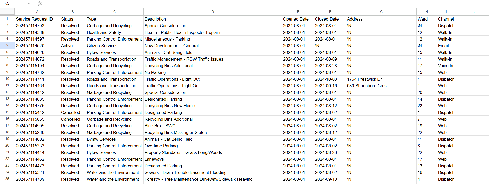
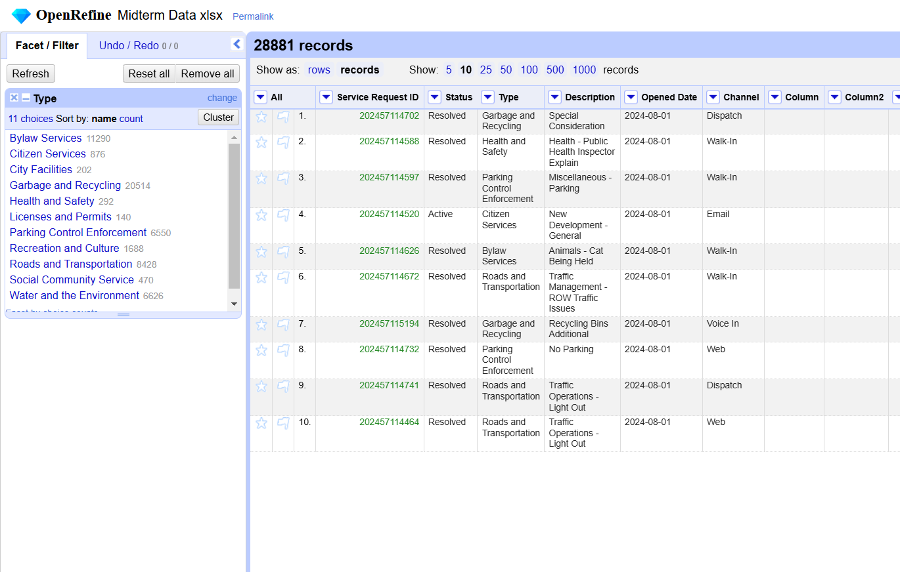

**November 4th**
**MPAD2003 Introductory Data Storytelling**
**Max Dillabough**
**Presented to Jean-Sébastien Marier**

# Midterm Project: Exploratory Data Analysis (EDA)
---
## Foreword
Support your claims by citing relevant sources. Please follow [APA guidelines for in-text citations](https://apastyle.apa.org/style-grammar-guidelines/citations).

And to create an unordered list, we simply put a star (`Unordered List`) before each item.

## 1. Introduction

In this assignment I will be analysing a city of Ottawa data set [*2024 Service Requests*](https://open.ottawa.ca/documents/65fe42e2502d442b8a774fd3d954cac5/about). This large set of data is a document that has, in detail, every service request made in the city of Ottawa throughout the year 2024. The document’s spreadsheet highlighted the following information about the service request: Service Request ID, Status, Type, Description, Opened Date, Closed Date, Address, Latitude, Longitude, Ward, and Channel. The channel section alludes to how the data was collected, the options are as follows: 311 Contact Centre, Client Service Centre, 311 Email, Web-based Self- Service portal. 

For the purpose of this assignment the data has been restricted to only include the incident reports made in August 2024. Within this dataset I will be writing about and studying the relation between each report’s type and status. 

*There are six sections to this document:*
1.  *Introduction*
1.  *Getting Data*
1. *Understanding Data* 
3.1 *VIMO Analysis*
3.2 *Cleaning Data*
3.3 *Explantory Data Analysis*
1. *Potential Story*
1. *Conclusion*
1. *References*

## 2. Getting Data

Sadly I had no part in the collection of the raw data presented by the city of Ottawa data set [*2024 Service Requests*](https://open.ottawa.ca/documents/65fe42e2502d442b8a774fd3d954cac5/about). After the data was collected it was posted online for the public to download and view. I downloaded the data through the link provided on Brightspace (LINK). After downloading the CSV file I imported it into google sheets. The un-edited, raw data that was given, looked like so: 



*The Raw Data*

There are eleven columns and twenty eight thousand, five hundred thirty nine rows. This massive data set is a collection of all service requests made to the city of Ottawa during the month of August. On my first look I concluded that the chart was very messy. I immediately began to think of how I could start to crop the unwanted and unneeded data. Each column had a French and an English translation. Column 1 labels every service request with an ID number, for example the first column is labelled with the ID number 202457114702, this is an example of a categorical variable. The column labelled Type contains nominal variables because of the lack of natural order, no type is better than another. There was an issue in the Longitude and Latitude columns; there are three rows that had both Longitude and Latitude set to zero, this is impossible as that would mean the requests were made off the coast of Africa even though they’re supposed to be made within Ottawa. These outliers are not alone in being inaccurate coordinates as there is one latitude that is labelled as 0.000408032393, this is an incorrect piece of data as it would place the call to dispatch outside of Canada and within South America. I knew that the editing and understanding data phase of this project would be a long strenuous task. 
	[Here is the link to my finished spreadsheet.](https://docs.google.com/spreadsheets/d/1nOKh_At9gIBojggtEPteNsc95fXGy0FLIGR02cvd0Wo/edit?usp=sharing)


## 3. Understanding Data
**Here are examples of functions and lines of code put in grey boxes:**

1. If you name a function, put it between "angled" quotation marks like this: `IMPORTHTML`.
1. If you want to include the entire line of code, do the same thing, albeit with your entire code: `=IMPORTHTML("https://en.wikipedia.org/wiki/China"; "table", 5)`.
1. Alternatively, you can put your code in an independent box using the template below:

``` r
=IMPORTHTML("https://en.wikipedia.org/wiki/China"; "table", 5)
```
This also shows how to create an ordered list. Simply put `1.` before each item.
### 3.1. VIMO Analysis

*Valid and Invalid Data:* For the most part all data is valid and usable. There are, at times, data that becomes near useless to my cause as it does not validate my analysis or what I am trying to prove. Columns like Longitude, Latitude, Address, Ward, and Closed Date are not helpful and therefore I have removed them from the sheet. 

*Missing Data:* Using the filter tool I was able to locate the placement of any blanks or “\N”s. However most missing data was within the Longitude, Latitude, Address, and Ward columns which serve no purpose. By removing the unwanted columns I have in-turn removed most of the missing data. The Description column contains a large amount of “\N” data points and one “blank” space. This missing data will not affect the outcome of this assignment therefore I will choose not to edit or remove it. Final piece of missing data I discovered was the Type for two service calls that fell under the description of Property Standards - Grass Long/Weeds. I believe that from the description I can rectify these missing types by placing them under Bylaw Services.

*Outliers:* As stated by Stats Canada "Outlier Values are extremly large or extremely small compared to what we might expect," not only according to this deffenition but also to the general consensus of what outliers entail I can confirm that there are no outliers in my data. By the time I was finished with the missing data portion I had no Outliers to discover or report. 

### 3.2. Cleaning Data

For this section of the assignment I used 4 tools to help me clean and organise my chosen data:
	*-The Filter Tool
	-Open Refine
	-Freeze Row Tool
	-`SPLIT` Function*

I found the filter tool very useful. It was clear to me that in order to create a chart that could show a relation between the three statuses a report can have that I needed to make use of the filter tool. I mostly used it to filter out data I wasn’t currently using but needed at a later time, such as the different statuses of the reports. In order to make my pie charts I would go from active, to resolved, and then cancelled so I could capture all necessary data. I also used the filter tool to find any missing data by filtering only the “blank”s and “\N”s.

Open Refine was a tool that I used to double check my work and my cleaned data. I downloaded my finished spreadsheet as a Microsoft Excel sheet, then imported it to Open Refine. Utilising the text facet feature I was able to reassure myself that my work was sound.

*Open Refine Screen Capture*

When working with such a massive data set you will find yourself constantly scrolling through thousands of rows of data. The freeze row tool helps you keep track of what you need to compare and for me it did just that. I constantly found myself wanting to compare rows of data that were thousands of lines away from one another. I also began to use it to freeze my first row so I was able to keep track of what column I was in.

`SPLIT` is a function in google sheets that separates one column into two. I used it when deciding to split both the description and the first row from their french translations. My full functions looked like this `=SPLIT(D2, "|")`then I would've dragged the function down through the whole sheet.

### 3.3. Exploratory Data Analysis (EDA)

Insert text here.

**This section should include a screen capture of your pivot table, like so:**

<br>
*Figure 2: This pivot table shows...*

**This section should also include a screen capture of your exploratory chart, like so:**

<br>
*Figure 3: This exploratory chart shows...*

## 4. Potential Story

Insert text here.

## 5. Conclusion

Insert text here.

## 6. References

Include a list of your references here. Please follow [APA guidelines for references](https://apastyle.apa.org/style-grammar-guidelines/references). Hanging paragraphs aren't required though.

**Here's an example:**

Bounegru, L., & Gray, J. (Eds.). (2021). *The Data Journalism Handbook 2: Towards A Critical Data Practice*. Amsterdam University Press. [https://ocul-crl.primo.exlibrisgroup.com/permalink/01OCUL_CRL/hgdufh/alma991022890087305153](https://ocul-crl.primo.exlibrisgroup.com/permalink/01OCUL_CRL/hgdufh/alma991022890087305153)
